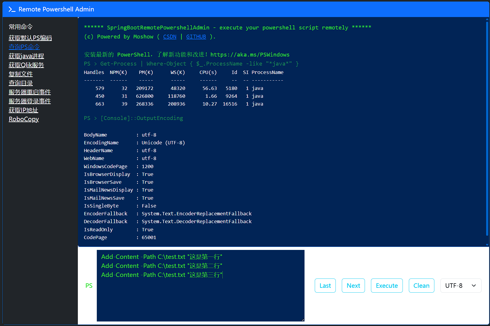
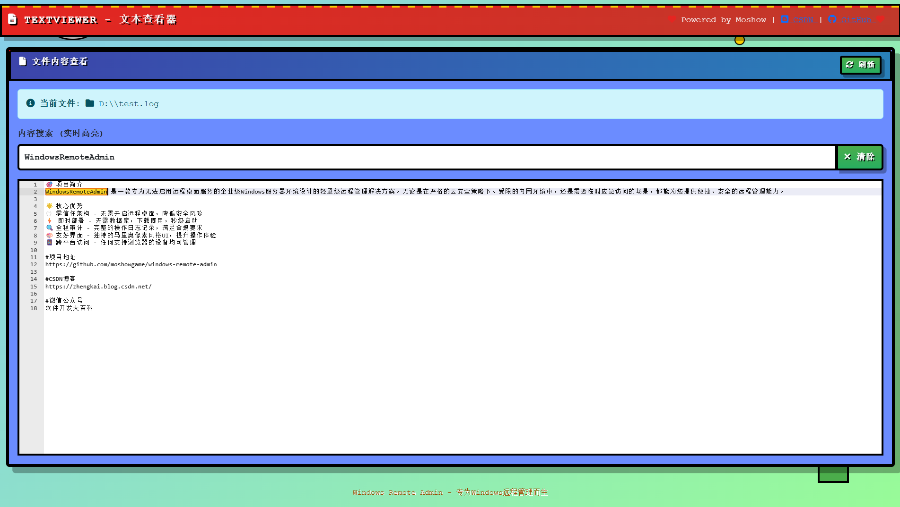

# WindowsRemoteAdmin 🖥️✨

<div align="center">

**专为无远程桌面环境的Windows系统打造的便携式管理工具**

[](https://spring.io/projects/spring-boot)
[](https://www.oracle.com/java/)
[](LICENSE)
[](https://www.microsoft.com/windows)

🚀 **零配置部署** | 🔒 **安全审计** | 💻 **跨平台访问** | 🎮 **马里奥像素风UI**

</div>

## 🎯 项目简介

**WindowsRemoteAdmin** 是一款专为无法启用远程桌面服务的企业级Windows服务器环境设计的轻量级远程管理解决方案。无论是在严格的云安全策略下、受限的内网环境中，还是需要临时应急访问的场景，都能为您提供便捷、安全的远程管理能力。

### 🌟 核心优势

- 🛡️ **零信任架构** - 无需开启远程桌面，降低安全风险
- ⚡ **即时部署** - 无需数据库，下载即用，秒级启动
- 🔍 **全程审计** - 完整的操作日志记录，满足合规要求
- 🎨 **友好界面** - 独特的马里奥像素风格UI，提升操作体验
- 📱 **跨平台访问** - 任何支持浏览器的设备均可管理

### 🎮 应用场景

| 场景 | 描述 | 解决方案 |
|------|------|----------|
| ☁️ **云服务器管理** | Azure/AWS/GCP等云平台Windows实例 | 无需公网暴露RDP端口，通过Web安全访问 |
| 🔒 **内网隔离环境** | 金融、政务等高安全要求网络 | 在不破坏网络隔离的前提下进行运维 |
| 🏢 **企业私有云** | VMware/Hyper-V虚拟化环境 | 统一Web界面管理多台虚拟机 |
| 🚨 **紧急故障处理** | 生产环境突发问题快速响应 | 移动端随时接入，快速定位解决问题 |
| 🔧 **日常运维作业** | 系统监控、日志分析、文件传输 | 一站式运维工具平台 |

## 🚀 核心功能

## 📸 功能演示

<table>
<tr>
<td width="50%">

### 🔧 PowerShell控制台


• 支持常用命令快速选择
• 多种编码格式切换
• 执行按钮智能防抖
• 命令历史记录回溯
• 实时输出结果显示

</td>
<td width="50%">

### 📁 文件资源管理器


• 自定义路径导航
• 文件类型图标识别
• 详细属性信息展示
• 快速文件下载功能
• 直观的时间排序

</td>
</tr>
<tr>
<td width="50%">

### 📖 文本查看器


• 支持<10MB文本文件
• 语法高亮显示
• 底部固定布局
• 快速滚动导航
• 字符编码自适应

</td>
<td width="50%">

### 📜 日志分析器


• 关键词智能搜索
• 匹配内容高亮显示
• 时间范围精确筛选
• 大日志高效检索
• 多条件组合过滤

</td>
</tr>
</table>

## 🛠️ 技术架构

```
┌─────────────────┐    ┌─────────────────┐    ┌─────────────────┐
│   Web Browser   │    │  Spring Boot 3  │    │   PowerShell    │
│  (Any Platform) │◄──►│   Undertow      │◄──►│  (Windows Only) │
└─────────────────┘    │                 │    └─────────────────┘
                       │  Security Layer │
                       │  Audit Logging  │
                       │  Session Mgmt   │
                       └─────────────────┘
```

### 🏗️ 核心组件

| 组件 | 技术栈 | 说明 |
|------|--------|------|
| **后端框架** | Spring Boot 3.3.4 | 现代化Java生态，性能卓越 |
| **Web容器** | Undertow | 轻量级高性能，内存占用低 |
| **安全认证** | Session + Cookie | 1天免登录，安全便捷 |
| **前端框架** | Bootstrap 5 + jQuery | 响应式设计，兼容性强 |
| **代码编辑** | CodeMirror 5 | 高性能文本渲染引擎 |
| **PowerShell** | jPowerShell 3.1.1 | Java-PowerShell桥接 |
| **构建工具** | Maven | 标准化项目构建 |
| **运行环境** | JDK 17 | LTS版本，稳定可靠 |

### 🔒 安全特性

- 🛡️ **认证授权** - 用户名+密码+用途三重验证
- 📋 **操作审计** - 完整的操作日志记录
- 🔐 **传输加密** - HTTPS安全通信保障
- ⏰ **会话管理** - 自动超时和安全退出
- 🌐 **IP追踪** - 客户端来源地址记录

## 🚀 快速上手

### 📋 环境要求

```bash
# 必需环境
✅ Windows 7/Server 2008及以上版本
✅ JDK 17+ (推荐Microsoft Build of OpenJDK 17)
✅ 512MB可用内存
✅ 100MB磁盘空间

# 推荐配置
🌟 4GB内存以上
🌟 SSD存储
🌟 稳定网络连接
```

### 🛠️ 部署步骤

#### 1. 获取项目

```bash
# 方式一：Git克隆（推荐）
git clone https://github.com/moshowgame/windows-remote-admin.git
cd WindowsRemoteAdmin

# 方式二：直接下载ZIP包
# 访问Release页面下载最新版本
```

#### 2. 编译构建

```bash
# 清理并编译
mvn clean compile

# 打包成可执行JAR
mvn package -DskipTests
```

#### 3. 启动服务

```bash
# 开发模式启动
mvn spring-boot:run

# 生产模式启动
java -jar target/WindowsRemoteAdmin-1.0.0.jar

# 后台运行（Linux/macOS）
nohup java -jar target/WindowsRemoteAdmin-1.0.0.jar > app.log 2>&1 &
```

#### 4. 访问验证

打开浏览器访问：**http://localhost:12306/**

看到粉色马里奥风格的登录界面即表示部署成功！🎉

### 🔧 配置说明

#### 用户认证配置
在 `src/main/resources/data/entitlement.csv` 中添加用户：

```csv
username,password
admin,admin123
ops,ops456
```

#### 端口修改
编辑 `application-dev.yml`：

```yaml
server:
  port: 8080  # 修改为你想要的端口
```

### 🎮 首次使用指南

1. **登录系统** - 使用配置的用户名密码登录
2. **设置用途** - 填写本次操作的具体用途（必填）
3. **开始管理** - 进入主控制台开始远程操作
4. **安全退出** - 操作完成后记得点击退出按钮

## 📝 版本发布历史

### 🎉 v1.0.0 (2026-02-15) - 全新升级版

**重大更新：全新品牌形象**

- 🔄 **品牌重塑** - 项目更名为WindowsRemoteAdmin，专注Windows远程管理
- 🎨 **界面革新** - 全新的粉色马里奥像素风格UI设计
- 🏗️ **架构升级** - 包结构调整，代码组织更加清晰
- 🔧 **路径优化** - 移除/sre路径前缀，访问更简洁
- 🛡️ **安全增强** - Cookie命名规范化，安全性提升

### ⚡ v0.9.5 (2025-10-12) - 性能优化版

- ⚡ **PowerShell优化** - 使用jPowerShell 3，支持多行脚本模式
- 🔐 **认证升级** - 鉴权机制优化，用户名和用途用于审计追溯
- 📊 **审计强化** - 添加客户端IP地址记录，完善操作追溯
- 🎯 **体验提升** - 多项易用性改进和bug修复

### 🚀 v0.9.0 (2025-04-06) - 功能完善版

- 📁 **文件管理增强** - 支持自定义路径导航，修复搜索功能
- 🔧 **PowerShell升级** - 新增编码选择，常用命令快捷输入
- 📜 **日志分析优化** - 添加时间范围筛选，提升检索效率

### 🎯 v0.8.0 (2025-03-11) - 界面优化版

- ✨ **编辑器升级** - LogViewer采用CodeMirror5，性能大幅提升
- 📱 **布局改进** - FileExplorer文本区域优化，长文本阅读体验更好

### 🔧 v0.7.0 (2025-03-10) - 稳定修复版

- 🐛 **关键修复** - 修复Shell界面API路径错误
- ⌨️ **功能恢复** - 上下键历史命令调用功能修复
- 📝 **日志完善** - 新增完整的审计日志配置

### 🌟 v0.5.0 (2025-03-09) - 核心功能版

- 📜 **新增功能** - LogViewer日志查看模块上线

### 🚀 v0.3.0 (2025-03-03) - 安全认证版

- 🔐 **安全增强** - 新增登录页面和Landing主页
- 🛡️ **权限控制** - 基础认证机制实现

### 🎉 v0.1.0 (2025-03-02) - 初始版本

- 📁 **基础功能** - 文件浏览和下载
- 🔧 **核心能力** - PowerShell命令执行
- 🌐 **Web界面** - 基础的Web管理界面

## 📄 开源许可

本项目采用 **Apache License 2.0** 开源协议，您可以：

✅ **自由使用** - 商业和个人项目均可免费使用
✅ **修改分发** - 可以修改源码并重新分发
✅ **专利保护** - 提供专利使用权保障

详细条款请查看项目根目录的 [LICENSE](LICENSE) 文件。

## 🤝 贡献指南

欢迎任何形式的贡献！

### 开发环境搭建

```bash
# Fork项目到你的GitHub
# Clone到本地
git clone https://github.com/YOUR_USERNAME/WindowsRemoteAdmin.git
cd WindowsRemoteAdmin

# 创建功能分支
git checkout -b feature/your-feature-name

# 提交修改
git commit -am "Add some feature"

git push origin feature/your-feature-name
```

### 贡献方向

- 🐛 Bug修复
- ✨ 新功能开发
- 📖 文档完善
- 🌍 多语言支持
- 🎨 UI/UX优化
- 🧪 测试用例补充

## ❓ 常见问题解答

### 🔧 技术问题

<details>
<summary><strong>Q：为什么日志查看限制在10MB以内？</strong></summary>

A：这是为了防止大文件加载导致内存溢出和服务崩溃。如果需要查看更大的日志文件，可以：

1. 修改源码中的文件大小限制（搜索 `fileSize < 10 * 1024 * 1024`）
2. 使用文件分割工具将大日志拆分成多个小文件
3. 通过PowerShell命令进行日志筛选后再查看
</details>

<details>
<summary><strong>Q：如何配置PowerShell命令白名单？</strong></summary>

A：在 `application.yml` 中添加配置：

```yaml
wra:
  powershell:
    whitelist: Get-Process,Get-Item,Get-ChildItem,Get-Service
```
</details>

<details>
<summary><strong>Q：审计日志保存在哪里？</strong></summary>

A：审计日志默认保存在项目目录下的 `logs/wra-audit.log` 文件中。可以通过修改 `log4j2-spring-dev.xml` 配置文件来自定义日志路径和格式。
</details>

### 🛡️ 安全相关

<details>
<summary><strong>Q：如何提高安全性？</strong></summary>

A：建议采取以下安全措施：

- 🔒 启用HTTPS访问
- 🔑 使用强密码策略
- 🌐 限制访问IP范围
- ⏰ 设置合理的会话超时时间
- 📊 定期审查审计日志
- 🛡️ 部署在防火墙后面
</details>

<details>
<summary><strong>Q：能否在外网环境使用？</strong></summary>

A：可以，但强烈建议：

- 必须配置SSL证书启用HTTPS
- 设置严格的访问控制策略
- 使用VPN或内网穿透服务
- 定期更新和安全扫描
</details>

### 🚀 部署运维

<details>
<summary><strong>Q：支持哪些Windows版本？</strong></summary>

A：支持以下Windows版本：

- Windows 7/8/10/11
- Windows Server 2008 R2及以上
- Azure/AWS/GCP云服务器Windows镜像
</details>

<details>
<summary><strong>Q：如何实现开机自启动？</strong></summary>

A：可以通过以下方式实现：

**Windows服务方式：**
```cmd
sc create WindowsRemoteAdmin binPath= "java -jar C:\path\to\WindowsRemoteAdmin-1.0.0.jar" start= auto
```

**任务计划程序：**
创建开机启动的任务，执行启动脚本。
</details>

<details>
<summary><strong>Q：能否支持Linux服务器？</strong></summary>

A：当前版本专注于Windows环境。未来计划开发Linux版本，将支持：

- Bash命令执行
- Linux文件系统管理
- 系统监控和诊断
- 可关注develop分支获取最新进展
</details>

### 💡 使用技巧

<details>
<summary><strong>Q：如何批量执行PowerShell命令？</strong></summary>

A：可以在PowerShell编辑器中编写多行脚本：

```powershell
# 示例：批量检查服务状态
Get-Service | Where-Object {$_.Status -eq "Running"} | Select-Object Name, Status
Write-Host "检查完成"
```
</details>

<details>
<summary><strong>Q：文件下载速度慢怎么办？</strong></summary>

A：优化建议：

- 压缩大文件后再下载
- 使用局域网高速传输
- 调整JVM堆内存大小
- 考虑使用专门的文件传输工具
</details>

<div align="center">

⭐ **如果觉得好用，请给个Star支持一下！**

</div>

---

<div align="center">

**WindowsRemoteAdmin** © 2025 | 专为Windows远程管理而生

Made with ❤️ for DevOps engineers

</div>