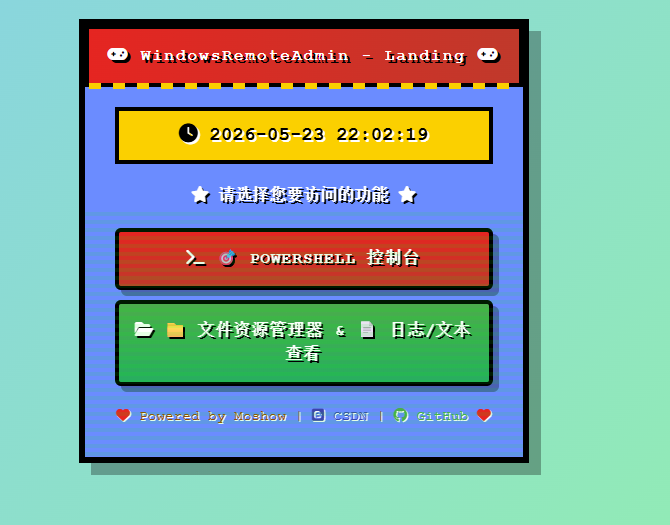
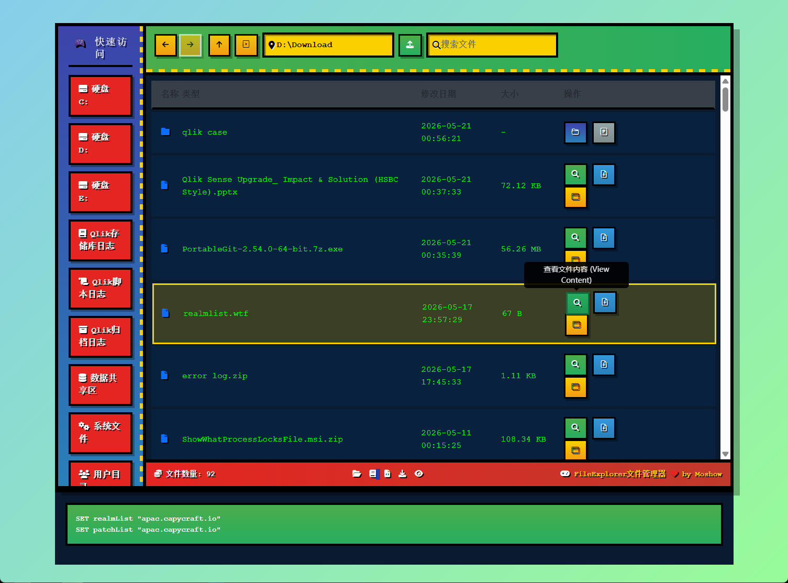
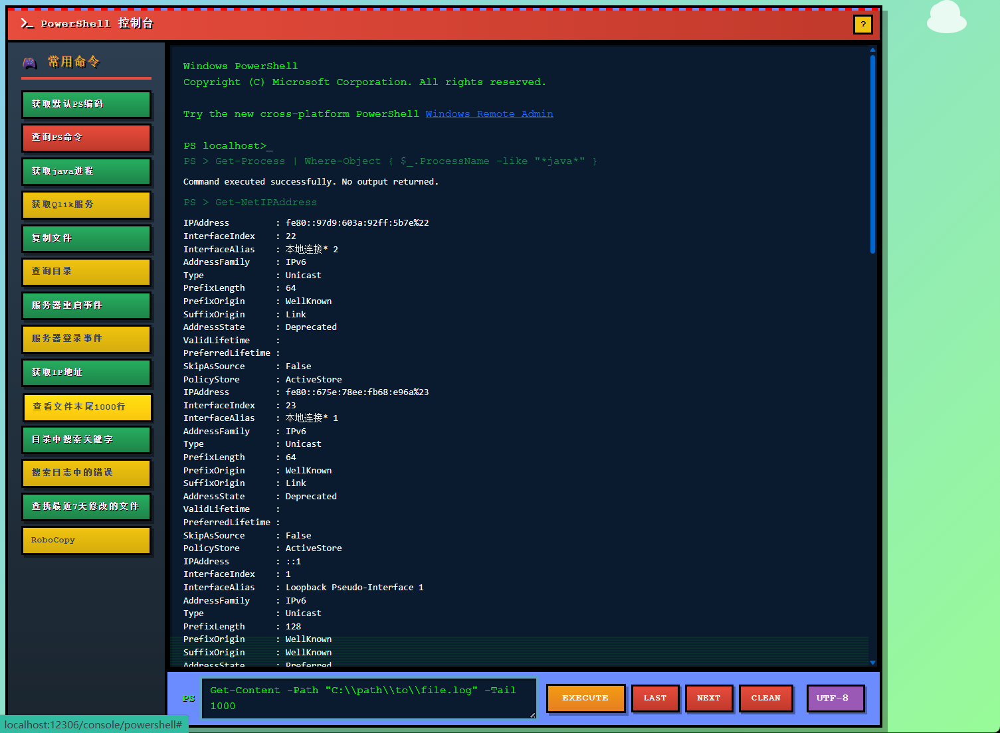
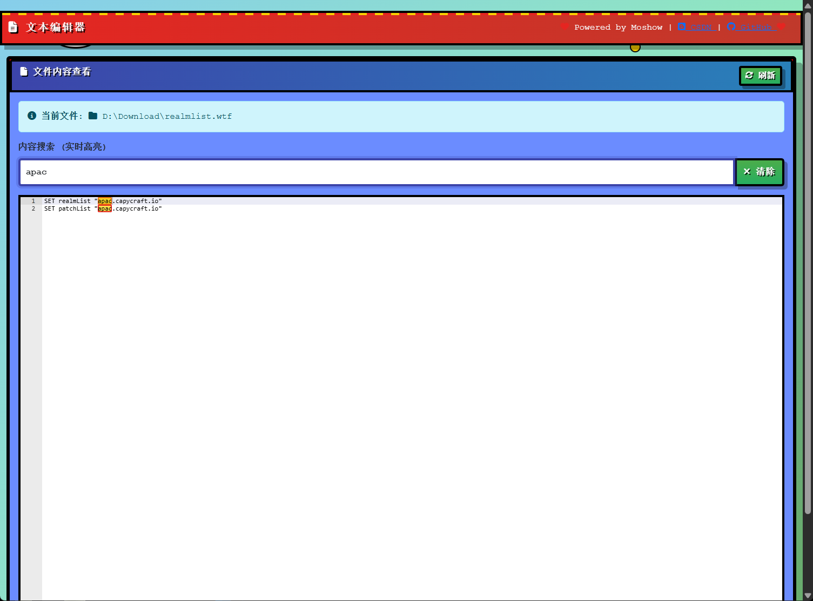
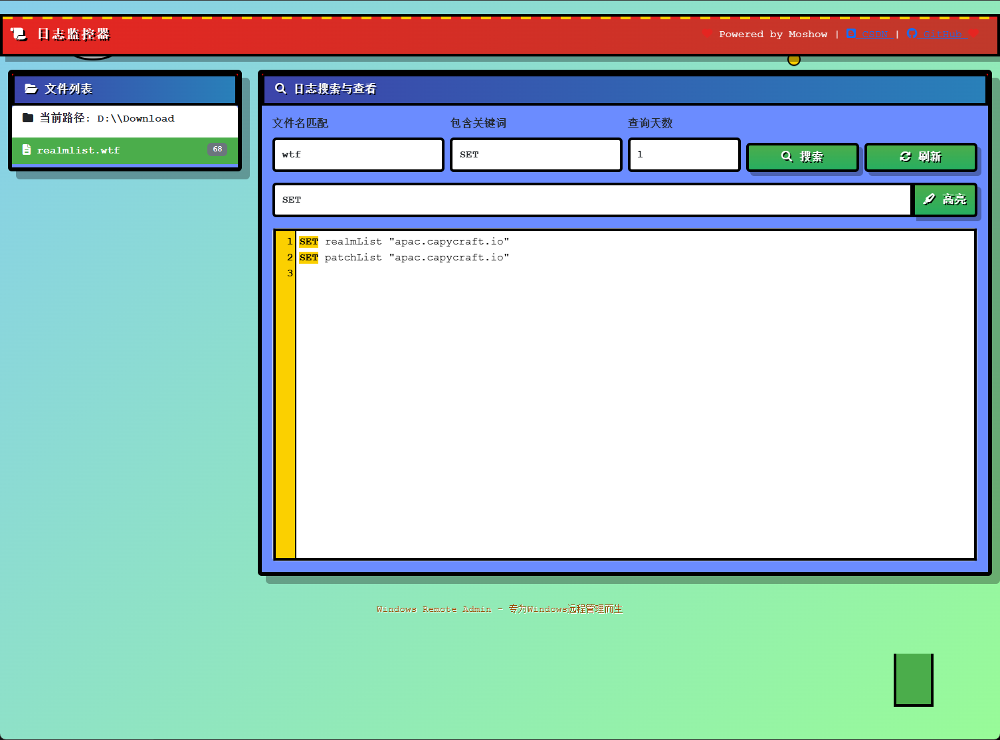

# 🎮 Windows Remote Admin (Go Edition)

<div align="center">

**便携式 Windows 远程管理工具 - Go 语言重构版**

[](https://go.dev/)
[](LICENSE)
[](https://www.microsoft.com/windows)

🌟 从 **Spring Boot Java 版本** 全新重构为 **Go 单二进制版本**

</div>

---

## 📖 目录

- [项目简介](#项目简介)
- [项目截图](#项目截图)
- [为什么选择 Go 重构？](#为什么选择-go-重构)
- [功能模块](#功能模块)
  - [PowerShell 控制台](#powershell-控制台)
  - [文件资源管理器](#文件资源管理器)
  - [文本编辑器](#文本编辑器)
  - [日志监控器](#日志监控器)
  - [认证与安全](#认证与安全)
- [日志系统](#日志系统)
- [技术架构](#技术架构)
- [快速开始](#快速开始)
- [部署指南](#部署指南)
- [API 文档](#api-文档)
- [开发指南](#开发指南)
- [从 Java 版迁移指南](#从-java-版迁移指南)
- [贡献与支持](#贡献与支持)

---

## 项目简介

**Windows Remote Admin (WRA)** 是一款专为 Windows 环境设计的轻量级远程管理工具。它通过 Web 浏览器提供直观的图形界面，让运维人员能够：

- 🔐 安全地远程执行 PowerShell 命令
- 📁 管理和浏览服务器文件系统
- 📝 在线查看和编辑文本/日志文件
- ⬆️⬇️ 上传下载文件
- 📊 实时监控日志文件

### ✨ 核心亮点

| 特性 | 说明 |
|------|------|
| **单二进制部署** | 编译后仅需一个 `.exe` 文件，无需 JVM、无需配置文件 |
| **零依赖运行** | 前端资源、模板、数据全部内嵌到二进制中 |
| **马里奥像素风格 UI** | 复古游戏主题，操作体验有趣且专业 |
| **结构化审计日志** | 11 个操作审计点 + 30 天自动轮转（zap + lumberjack） |
| **轻量高效** | 内存占用 < 20MB，启动时间 < 1 秒 |

---

## 📸 项目截图

Style=`马里奥像素风格`

| 页面 | 截图 |
|------|------|
| **登录页面** — 认证界面 |  |
| **首页导航** — 功能模块入口与快速跳转 |  |
| **文件资源管理器** — 文件浏览、下载、编辑、日志监控 |  |
| **PowerShell 控制台** — 远程命令执行与结果展示 |  |
| **文本编辑器** — 在线查看与编辑文本/配置文件 |  |
| **日志监控器** — 日志文件搜索、关键词高亮与实时监控 |  |

---

## 为什么选择 Go 重构？

### 🔄 重构背景

本项目最初使用 **Spring Boot + Java** 开发，在长期生产实践中发现以下痛点，最终决定使用 **Go 语言** 进行全面重写。

### 🎯 为什么 Go 特别适合此项目？

```
┌─────────────────────────────────────────────────────────────┐
│                    项目特性分析                               │
├──────────────┬──────────────────┬───────────────────────────┤
│   项目需求    │     Go 优势      │        具体体现            │
├──────────────┼──────────────────┼───────────────────────────┤
│ 工具型应用    │  单文件分发      │  embed 打包所有资源         │
│ 便携性要求    │  交叉编译        │  CGO_ENABLED=0 跨平台编译    │
│ 低资源消耗    │  高效内存管理    │  无 GC 压力，适合嵌入式场景   │
│ 快速响应      │  编译型语言      │  冷启动极快                 │
│ Shell 执行    │  os/exec 原生支持│  直接调用 powershell.exe    │
│ 文件操作      │  标准库完善      │  io/ioutil, path/filepath   │
│ Web 服务      │  Gin 高性能框架  │  比 Spring 快 10x+          │
│ 并发请求      │  Goroutine       │  轻量线程，百万级并发能力     │
└──────────────┴──────────────────┴───────────────────────────┘
```

---

## 功能模块

### 🔷 访问地址总览

```
http://localhost:12306/
```

| 模块 | 路由路径 | 功能描述 |
|------|----------|----------|
| 登录页 | `/login` | 用户身份验证 |
| 功能导航 | `/landing` | 模块入口（马里奥像素风格） |
| **PowerShell 控制台** | `/console/powershell` | 远程命令执行终端 |
| **文件资源管理器** | `/explorer` | 文件浏览、上传、下载 |
| **文本编辑器** | `/texteditor` | 文本文件在线查看/编辑 |
| **日志监控器** | `/logmonitor` | 日志文件实时监控与搜索 |

> **默认账号**: `admin` / `admin123`

---

### 💻 PowerShell 控制台 (`/console/powershell`)

<div align="center">


</div>

#### 功能特性

- ✅ **实时交互式终端**：类似 ISE 的 Web 终端体验
- ✅ **命令历史记录**：支持上下键翻阅历史命令
- ✅ **常用命令快捷按钮**：预置高频运维命令（进程查询、服务状态等）
- ✅ **Base64 安全编码**：自动编码避免特殊字符转义问题
- ✅ **输出噪声过滤**：智能清理 CLIXML 序列化噪声和进度信息
- ✅ **60 秒超时保护**：防止长时间挂起命令占用资源
- ✅ **UTF-8 编码支持**：正确处理中文输出
- ✅ **执行审计日志**：完整记录每次命令执行的用户和时间

#### 适用场景

```powershell
# 系统信息查询
Get-Process | Where-Object { $_.ProcessName -like "*java*" }
Get-Service | Where-Object { $_.Status -eq "Running" }

# 系统管理
Restart-Service -Name "QlikSenseRepositoryService"
Get-WmiObject Win32_OperatingSystem | Select-Object Caption, Version

# 网络诊断
Test-Connection -ComputerName google.com -Count 4
netstat -an | Select-String "LISTEN"
```

#### 技术实现

```
前端 (Web Terminal) 
    ↓ WebSocket-style AJAX POST
后端 Handler (psHandler.Execute)
    ↓ Base64 Encode (-EncodedCommand)
PowerShell Engine (os/exec.Command)
    ↓ UTF-16LE Output
CLIXML Filter (正则清理)
    ↓ Response JSON
前端渲染显示
```

---

### 📁 文件资源管理器 (`/explorer`)

<div align="center">


</div>

#### 功能特性

##### 核心功能

| 功能 | 操作方式 | 说明 |
|------|----------|------|
| **目录浏览** | 点击文件夹图标 / 双击文件项 | 进入子目录，面包屑导航 |
| **文件查看** | 点击 🔍 放大镜按钮 | 当前页面底部显示内容（轻量） |
| **文本编辑** | 点击 🪟 编辑器按钮 | 新标签页打开完整文本编辑器（重量） |
| **文件下载** | 点击 ⬇️ 下载按钮 | 触发浏览器下载到本地 |
| **日志监控** | 点击 📄 日志按钮 | 跳转到日志监控页面 |
| **文件上传** | 工具栏上传按钮 | 支持多文件批量上传（单文件上限 100MB） |
| **路径导航** | 地址栏输入 + 回车 | 直接跳转到任意路径 |
| **搜索过滤** | 搜索框输入 | 实时过滤当前目录文件名 |

##### 快速访问侧边栏

预置常用运维路径：
- `C:\`, `D:\`, `E:\` （磁盘根目录）
- Qlik Sense 日志目录（Repository / Script）
- 归档日志目录
- 数据共享区
- 系统目录 (`C:\Windows\System32`)
- 用户目录 (`C:\Users`)

##### UI 交互增强

- ✅ 所有操作按钮带 **Tooltip 提示**
- ✅ 按钮 Hover 时有 **颜色渐变 + 位移动画**
- ✅ 文件列表项 Hover 有 **高亮边框效果**
- ✅ 马里奥像素风格视觉主题
- ✅ 响应式布局适配不同屏幕

##### 文件类型图标映射

| 类型 | FontAwesome 图标 | Bootstrap Icon |
|------|------------------|----------------|
| 文件夹 | `fa-folder` | `bi-folder2-open` (进入) |
| Word文档 | `fa-file-word` | - |
| 可执行文件 | `fa-file-code` | `bi-code-square` (读取) |
| 符号链接 | `fa-link` | - |
| 其他文件 | `fa-file` | `bi-file-earmark-arrow-down` (下载) |

#### 操作按钮矩阵

| 图标 | 颜色 | 类名 | Tooltip | 行为 |
|------|------|------|---------|------|
| 📁 | 蓝色 | `btn-primary` | 进入文件夹 (Enter) | 进入目录 |
| 📄 | 灰色 | `btn-secondary` | 日志监控器 (Log Monitor) | 跳转日志页 |
| 🔍 | 绿色 | `btn-success` | 查看文件内容 (View Content) | 页面内显示 |
| ⬇️ | 蓝色 | `btn-info` | 下载文件 (Download) | 浏览器下载 |
| 🪟 | 橙色 | `btn-warning` | 在文本编辑器中打开 (Open in Editor) | 跳转编辑器 |

---

### 📝 文本编辑器 (`/texteditor`)

<div align="center">


</div>

#### 功能特性

- ✅ **Ace Editor 内核**：专业的代码编辑器组件
- ✅ **语法高亮**：自动识别文件类型并应用对应语法高亮
- ✅ **实时搜索**：支持关键词高亮匹配
- ✅ **大文件优化**：流式加载，支持查看大型文本文件
- ✅ **多主题切换**：支持多种编辑器配色方案
- ✅ **只读模式**：当前为安全查看模式（未来可扩展编辑保存）

#### 使用场景

- 查看 **配置文件**（.json, .yaml, .xml, .ini, .conf）
- 分析 **脚本代码**（.ps1, .bat, .cmd, .vbs）
- 阅读 **日志片段**（.log, .txt）
- 检查 **数据文件**（.csv, .sql）

#### 访问方式

```
/texteditor?filePath=C:\path\to\file.txt
```

---

### 📊 日志监控器 (`/logmonitor`)

<div align="center">


</div>

#### 功能特性

- ✅ **CodeMirror 编辑器内核**：专为日志查看优化的显示引擎
- ✅ **高级搜索条件**：
  - 文件名模糊匹配（支持通配符）
  - 内容关键词过滤
  - 时间范围筛选（按天数）
- ✅ **实时高亮**：搜索关键词即时标记
- ✅ **侧边栏文件列表**：快速切换不同日志文件
- ✅ **自动刷新**：一键重新加载最新日志
- ✅ **多文件对比**：侧边栏列出同目录下所有匹配文件

#### 使用场景

```
# 监控 Qlik Sense 日志
/logmonitor?filePath=C:\ProgramData\Qlik\Sense\Log\Repository

# 监控特定时间段日志
/logmonitor?fileNamePattern=*.log&keyWord=ERROR&days=7

# 监控归档日志
/logmonitor?filePath=D:\QlikShare\ArchivedLogs
```

#### 与文本编辑器的区别

| 特性 | 文本编辑器 | 日志监控器 |
|------|-----------|-----------|
| **定位** | 通用文件查看 | 专业日志分析 |
| **编辑器** | Ace Editor | CodeMirror |
| **搜索** | 简单关键词 | 多维度条件组合 |
| **文件浏览** | 单文件 | 侧边栏多文件列表 |
| **适用场景** | 配置、代码、数据 | 日志、审计、排查 |

---

### 🔐 认证与安全

#### 认证机制

```
┌─────────────┐    ┌──────────────┐    ┌─────────────┐
│   用户登录   │ ─→ │  CSV 校验    │ ─→ │ Session 创建 │
│  (用户名密码) │    │ entitlement  │    │ (Cookie 存储)│
└─────────────┘    │   .csv       │    └─────────────┘
                   └──────────────┘           │
                                              ▼
                                      ┌─────────────┐
                                      │  后续请求携带 │
                                      │  Session ID  │
                                      └─────────────┘
```

#### 安全措施

| 措施 | 实现细节 |
|------|----------|
| **Session 管理** | Cookie-based，24 小时过期，HttpOnly 标记防 XSS |
| **白名单路由** | `/login`, `/static/*` 等公开路径免认证 |
| **AJAX 区分** | API 请求未认证返回 401 JSON；页面请求重定向 `/login` |
| **审计日志** | 11 个操作点结构化记录，JSON 格式，30 天自动轮转 |
| **文件大小限制** | 读取 10MB、上传 100MB 上限 |
| **MIME 类型检查** | 仅允许文本类文件读取，阻止二进制泄露 |
| **路径安全** | 自动规范化路径，防止目录遍历攻击 |

#### 用户管理

用户凭据存储在 `data/entitlement.csv` 文件中：

```csv
username,password
admin,admin123
```

> **提示**: 生产环境请修改默认密码！CSV 格式便于批量管理用户。

---

## 📋 日志系统

### 日志文件输出

程序启动后，日志自动输出到 **可执行文件所在目录** 下的 `logs/` 文件夹：

```
windows-remote-admin.exe
└── logs/
    ├── app.log        # 应用运行日志（启动/错误/警告）
    ├── audit.log      # 审计日志（用户操作记录）⭐
    └── access.log     # HTTP 访问日志（请求记录）
```

> **路径说明**：日志目录始终跟随 exe 文件位置，无论从哪个目录启动程序。

### 三类日志对比

| 日志文件 | 内容 | 输出目标 | 格式 | 典型用途 |
|----------|------|----------|------|----------|
| **app.log** | 应用生命周期、错误、警告 | 文件 + 控制台 | JSON + 彩色文本 | 排查启动问题、运行异常 |
| **audit.log** | 用户登录/命令执行/文件操作等 | 仅文件（安全） | JSON 结构化 | 安全审计、行为追溯 |
| **access.log** | HTTP 请求记录（Gin 框架生成） | 仅文件 | JSON | 流量分析、接口监控 |

### 自动维护策略（Lumberjack）

| 配置项 | 值 | 说明 |
|--------|-----|------|
| **MaxSize** | 10 MB | 单个日志文件超过 10MB 时自动切割 |
| **MaxBackups** | 30 个 | 最多保留 30 个历史备份文件 |
| **MaxAge** | 30 天 | 超过 30 天的旧日志自动删除 ⏰ |
| **Compress** | 开启 | 历史日志自动 GZip 压缩（`.gz`） |

> 审计合规：日志默认保留 **30 天**，满足大多数安全审计要求。可通过修改 `internal/logger/logger.go` 调整。

### 审计日志示例

**audit.log** 输出的结构化 JSON 记录：

```json
{"level":"INFO","time":"2026-05-26 00:16:56.422","caller":"handler/auth.go:73","msg":"用户登录成功","username":"admin","purpose":"运维检查","ip":"192.168.1.100"}
{"level":"INFO","time":"2026-05-26 00:17:02.336","caller":"handler/powershell.go:49","msg":"PowerShell 命令执行","username":"admin","command":"Get-Process","ip":"192.168.1.100"}
{"level":"INFO","time":"2026-05-26 00:17:10.445","caller":"handler/file.go:71","msg":"下载文件","username":"admin","path":"C:\\Logs\\app.log","ip":"192.168.1.100"}
{"level":"INFO","time":"2026-05-26 00:17:15.112","caller":"middleware/auth.go:50","msg":"未授权访问被拦截","path":"/execute","method":"POST","ip":"10.0.0.5"}
```

### 覆盖的用户操作审计点

以下所有用户行为都会自动记录到 `audit.log`：

| 操作类型 | 触发条件 | 记录字段 |
|----------|----------|----------|
| ✅ 登录成功 | POST `/login` 验证通过 | `username`, `purpose`, `ip` |
| ❌ 登录失败 | POST `/login` 密码错误 | `username`, `ip` |
| 🚪 登出 | POST `/logout` | `username`, `ip` |
| ⚡ 命令执行 | POST `/execute` 执行 PS | `username`, `command`, `encoding`, `ip` |
| 📂 列出目录 | POST `/list` 浏览文件夹 | `username`, `path`, `ip` |
| 🔍 搜索文件 | POST `/listPlus` 条件查询 | `username`, `pattern`, `keyword`, `ip` |
| 📥 下载文件 | POST `/download` 下载 | `username`, `path`, `ip` |
| 📖 读取文件 | POST `/read` 打开文本 | `username`, `path`, `ip` |
| 📤 上传文件 | POST `/upload` 上传 | `username`, `targetPath`, `sizeBytes`, `replaced`, `ip` |
| 🔀 路径规范化 | POST `/normalizedPath` | `original`, `normalized`, `ip` |
| 🚫 未授权访问 | 中间件拦截无 Session 请求 | `path`, `method`, `ip` |

### 技术实现

```
uber-go/zap (高性能结构化日志)
├── appCore   → lumberjack.Writer → logs/app.log     + os.Stdout (控制台)
├── auditCore → lumberjack.Writer → logs/audit.log   (仅文件，安全)
└── accessCore→ lumberjack.Writer → logs/access.log  (仅文件)
                                    ↑
                              MaxSize: 10MB, MaxAge: 30天, Compress: true
```

---

## 技术架构

### 整体架构图

```
┌─────────────────────────────────────────────────────────────────┐
│                        客户端 (Browser)                         │
│  ┌──────────┐ ┌──────────┐ ┌──────────┐ ┌──────────┐ ┌───────┐ │
│  │  Login   │ │ Landing  │ │ Console  │ │ Explorer │ │ Editor│ │
│  │  Page    │ │  Page    │ │  (PS)    │ │  (FS)    │ │(Log)  │ │
│  └────┬─────┘ └────┬─────┘ └────┬─────┘ └────┬─────┘ └──┬────┘ │
│       └────────────┴────────────┴────────────┴───────────┘     │
│                          HTTP/HTTPS                             │
└──────────────────────────────┬──────────────────────────────────┘
                               │
┌──────────────────────────────▼──────────────────────────────────┐
│                     Gin Web Framework                            │
│  ┌────────────┐  ┌────────────┐  ┌────────────────────────────┐ │
│  │  Router    │  │ Middleware │  │    Static + Templates       │ │
│  │  Group     │  │ AuthCheck  │  │    (embed 内嵌)             │ │
│  └─────┬──────┘  └─────┬─────┘  └────────────────────────────┘ │
│        │               │                                        │
│  ┌─────▼───────────────▼─────────────────────────────────────┐  │
│  │                  Handler Layer (Controller)                │  │
│  │  ┌──────────┐ ┌──────────┐ ┌──────────────────────────┐   │  │
│  │  │ Auth     │ │ File     │ │ PowerShell               │   │  │
│  │  │ Handler  │ │ Handler  │ │ Handler                  │   │  │
│  │  └────┬─────┘ └────┬─────┘ └────────────┬─────────────┘   │  │
│  └───────┼─────────────┼───────────────────┼─────────────────┘  │
│          │             │                   │                    │
│  ┌───────▼─────────────▼───────────────────▼─────────────────┐  │
│  │                   Service Layer (Business)                 │  │
│  │  ┌──────────────┐ ┌──────────────┐ ┌──────────────────┐   │  │
│  │  │ Entitlement  │ │ FileSystem   │ │ PowerShell       │   │  │
│  │  │ Service      │ │ Service      │ │ Service          │   │  │
│  │  │ (CSV Auth)   │ │ (File Ops)   │ │ (Shell Execute)  │   │  │
│  │  └──────────────┘ └──────────────┘ └──────────────────┘   │  │
│  └───────────────────────────────────────────────────────────┘  │
│                                                                  │
│  ┌───────────────────────────────────────────────────────────┐  │
│  │              Infra Layer                                  │  │
│  │  Config │ Model │ Util │ Logger                          │  │
│  └───────────────────────────────────────────────────────────┘  │
└─────────────────────────────────────────────────────────────────┘
```

### 项目目录结构

```
windows-remote-admin-go/
│
├── main.go                      # 应用入口：引擎初始化、路由注册、服务启动
├── embed.go                     # //go:embed 指令：内嵌静态资源和模板
│
├── internal/                    # 内部包（不对外暴露）
│   ├── config/
│   │   └── config.go           # 配置管理（端口、Session密钥等）
│   │
│   ├── model/
│   │   └── model.go            # 数据结构定义（请求/响应模型）
│   │
│   ├── middleware/
│   │   └── auth.go             # 认证中间件（Session校验 + 白名单）
│   │
│   ├── handler/                 # HTTP 处理器层（Controller）
│   │   ├── auth.go             #   登录、登出、页面渲染
│   │   ├── file.go             #   文件CRUD、列表、下载、上传
│   │   └── powershell.go       #   命令执行、输出处理
│   │
│   ├── service/                 # 业务逻辑层（Singleton 模式）
│   │   ├── entitlement.go       #   CSV 用户认证服务
│   │   ├── filesystem.go        #   文件系统操作服务
│   │   └── powershell.go        #   PowerShell 执行引擎
│   │
│   ├── logger/                   # 日志系统（结构化日志 + 自动维护）
│   │   └── logger.go           #   zap + lumberjack 日志框架
│   │
│   └── util/
│       └── response.go         # 统一响应封装工具
│
├── data/
│   └── entitlement.csv          # 用户凭据存储（username,password）
│
├── web/                         # 前端资源（编译时内嵌）
│   ├── templates/               # HTML 模板（6 个页面）
│   │   ├── login.html           #   登录页面
│   │   ├── landing.html         #   功能导航主页
│   │   ├── explorer.html        #   文件资源管理器
│   │   ├── texteditor.html      #   文本编辑器
│   │   ├── logmonitor.html      #   日志监控器
│   │   └── powershell.html      #   PowerShell ISE 终端
│   │
│   └── static/                  # 静态资源库
│       ├── bootstrap/           #   CSS Framework 5.3.2
│       ├── font-awesome/        #   Icons 6.4.0
│       ├── jquery/              #   JS Library 3.7.1
│       ├── codemirror/          #   Editor 5.65 (Log Viewer)
│       └── ace/                 #   Editor 1.37 (Text Editor)
│
├── @Run.cmd                     # Windows 启动脚本
├── @Build.cmd                   # 构建脚本
├── @Package.cmd                 # 打包脚本
├── go.mod                       # Go 模块定义
├── go.sum                       # 依赖锁定文件
└── README.md                    # 本文档
```

### 技术栈一览

| 层面 | 技术 | 选型理由 |
|------|------|----------|
| **语言** | Go 1.21+ | 编译型、高性能、单二进制 |
| **Web 框架** | Gin v1.10 | 高性能 HTTP 路由，生态成熟 |
| **Session** | gin-contrib/sessions | Cookie-based，简单可靠 |
| **模板引擎** | Gin html/template | 服务端渲染，SEO 友好 |
| **前端 UI** | Bootstrap 5 + FA6 | 响应式布局，丰富组件 |
| **代码编辑器** | Ace Editor | 轻量、语法高亮丰富 |
| **日志查看器** | CodeMirror 5 | 搜索能力强，可定制 |
| **Shell 引擎** | os/exec + powershell.exe | 原生调用，无第三方依赖 |
| **资源嵌入** | //go:embed | 零外部依赖部署 |
| **日志框架** | uber-go/zap + lumberjack | 结构化日志 + 自动切割清理 |

---

## 快速开始

### 环境要求

- **操作系统**: Windows Server 2016+ / Windows 10+
- **Go 版本**: 1.21+ (仅开发需要)
- **运行时**: 无需任何依赖（直接运行 exe）

### 方式一：直接运行（推荐）

```bash
# 1. 克隆仓库
git clone https://github.com/moshowgame/windows-remote-admin.git
cd windows-remote-admin-go

# 2. 构建项目
go build -o windows-remote-admin.exe .

# 3. 运行
.\@Run.cmd
# 或双击 windows-remote-admin.exe
```

### 方式二：使用构建脚本

```bash
# 构建 Release 版本
.\@Build.cmd

# 打包发布版本
.\@Package.cmd
```

### 访问应用

打开浏览器访问：**http://localhost:12306/**

默认账号：`admin` / `admin123`

> ⚠️ **首次运行前**：确保 `data/entitlement.csv` 存在，不存在时会自动创建默认账号。

---

## 部署指南

### 便携部署（推荐）

**最简部署方式** —— 只需一个文件：

```bash
# 将 windows-remote-admin.exe 复制到目标机器
copy windows-remote-admin.exe D:\Tools\

# 直接运行
D:\Tools\windows-remote-admin.exe
```

✅ 无需安装 JRE  
✅ 无需配置文件  
✅ 无需附加目录  
✅ 可放在 U 盘随身携带  

### 自定义配置

通过环境变量覆盖默认设置：

| 环境变量 | 默认值 | 说明 |
|----------|--------|------|
| `WRA_PORT` | `12306` | 监听端口 |
| `WRA_SESSION_KEY` | `random-generated` | Session 加密密钥 |

示例：

```bash
set WRA_PORT=8080
set WRA_SECRET=my-super-secret-key-2024
.\windows-remote-admin.exe
```

### 生产环境建议

1. **修改默认密码**
   ```csv
   # data/entitlement.csv
   username,password
   admin,your-strong-password-here!
   ```

2. **配置反向代理（可选）**
   ```nginx
   server {
       listen 443 ssl;
       server_name admin.example.com;
       
       ssl_certificate /path/to/cert.pem;
       ssl_certificate_key /path/to/key.pem;
       
       location / {
           proxy_pass http://127.0.0.1:12306;
           proxy_set_header Host $host;
           proxy_set_header X-Real-IP $remote_addr;
       }
   }
   ```

3. **Windows 防火墙放行**
   ```powershell
   New-NetFirewallRule -Name "WRA" -DisplayName "Windows Remote Admin" `
       -Enabled True -Direction Inbound -Protocol TCP -LocalPort 12306 `
       -Action Allow
   ```

4. **注册为 Windows 服务（可选）**
   ```powershell
   # 使用 NSSM (Non-Sucking Service Manager)
   nssm install WRA "D:\Tools\windows-remote-admin.exe"
   nssm set WRA AppDirectory D:\Tools\
   nssm start WRA
   ```

---

## API 文档

### 公开接口（无需认证）

| 方法 | 路径 | 说明 |
|------|------|------|
| GET | `/login` | 登录页面 |
| POST | `/login` | 登录认证（JSON: `{username, password}`） |

### 受保护接口（需要 Session）

#### 页面路由

| 方法 | 路径 | Handler | 说明 |
|------|------|---------|------|
| GET | `/landing` | auth.LandingPage | 功能导航页 |
| GET | `/console/powershell` | ps.PowerShellPage | PowerShell 控制台 |
| GET | `/explorer` | file.FilePage | 文件资源管理器 |
| GET | `/texteditor` | file.TextViewerPage | 文本编辑器 |
| GET | `/logmonitor` | file.LogViewerPage | 日志监控器 |

#### 数据接口

| 方法 | 路径 | Handler | 说明 | 请求体 |
|------|------|---------|------|--------|
| POST | `/execute` | ps.Execute | 执行 PS 命令 | `{command: string}` |
| POST | `/list` | file.ListFiles | 列出目录 | `{filePath: string}` |
| POST | `/listPlus` | file.ListFilesPlus | 条件搜索 | `{filePath, pattern?, keyword?, days?}` |
| POST | `/download` | file.DownloadFile | 下载文件 | `{filePath: string}` |
| POST | `/read` | file.ReadFile | 读取文本 | `{filePath: string}` |
| POST | `/upload` | file.UploadFile | 上传文件 | `multipart/form-data` |
| POST | `/normalizedPath` | file.NormalizePath | 规范化路径 | `{filePath: string}` |
| POST | `/logout` | auth.Logout | 登出 | - |

#### 响应格式

**成功响应**:
```json
{
    "code": 200,
    "msg": "success",
    "data": { ... }
}
```

**错误响应**:
```json
{
    "code": 500,
    "msg": "error message",
    "data": null
}
```

---

## 开发指南

### 本地开发

```bash
# 1. 安装依赖
go mod download

# 2. 启动开发服务器（热加载）
go run main.go

# 3. 访问测试
open http://localhost:12306/login
```

### 添加新功能模块的标准流程

1. **在 `internal/handler/` 添加处理器方法**
2. **在 `internal/service/` 添加业务逻辑**
3. **在 `main.go` 注册新路由**
4. **在 `web/templates/` 创建 HTML 模板**
5. **更新本文档的功能模块章节**

### 代码规范

- 遵循 Go 官方代码规范
- Handler 层仅做参数绑定和调用 Service
- Service 层包含核心业务逻辑
- 所有错误返回统一 `util.Response` 格式

---

## 从 Java 版迁移指南

如果你是原 Java 版本的用户，以下是主要变更点：

### 路由变更对照表

| Java 版路由 | Go 版路由 | 说明 |
|------------|----------|------|
| `/powershell` | `/console/powershell` | 归类到 console 分组 |
| `/file` | `/explorer` | 更准确的命名 |
| `/textViewer` | `/texteditor` | 统一命名风格 |
| `/logViewer` | `/logmonitor` | 强调监控能力 |

### 功能差异

| 特性 | Java 版 | Go 版 |
|------|---------|-------|
| 运行方式 | `java -jar app.jar` 需要 JRE | 直接运行 `.exe` |
| 体积 | 60-100 MB (JAR + 依赖) | 12-18 MB (单一 exe) |
| 启动时间 | 5-15 秒 | < 0.5 秒 |
| 内存占用 | 200-500 MB | 10-25 MB |
| 配置文件 | application.yml | 环境变量（可选） |
| 静态资源 | 外部目录 `web/` | 内嵌到二进制 |

### 迁移步骤

1. ✅ **备份数据**: 导出 `data/entitlement.csv` 中的用户数据
2. ✅ **替换程序**: 用 Go 版 exe 替代原来的 jar 包
3. ✅ **恢复用户**: 将 CSV 复制到 exe 同级目录（或重新内嵌）
4. ✅ **更新书签**: 更新浏览器收藏夹中的 URL
5. ✅ **验证功能**: 逐个测试各模块功能正常

### 已知限制（相比 Java 版）

- ~~Spring Security~~ → 使用简单的 Session + 中间件（够用且更轻量）
- ~~MyBatis/Hibernate~~ → 直接操作文件系统（无需 ORM）
- ~~Thymeleaf 模板~~ → Go html/template（更简单）
- ~~application.yml 配置~~ → 环境变量 + 默认值（更灵活）

## 贡献与支持

### 如何贡献

1. Fork 本仓库
2. 创建特性分支 (`git checkout -b feature/amazing-feature`)
3. 提交更改 (`git commit -m 'Add amazing feature'`)
4. 推送到分支 (`git push origin feature/amazing-feature`)
5. 创建 Pull Request

### 问题反馈

- 🐛 Bug 报告: [GitHub Issues](https://github.com/moshowgame/windows-remote-admin/issues)
- 💡 功能建议: [GitHub Discussions](https://github.com/moshowgame/windows-remote-admin/discussions)


### 开源协议

本项目采用 MIT 协议开源，详见 [LICENSE](LICENSE) 文件。

---

<div align="center">

**⭐ 如果这个项目对你有帮助，请给一个 Star 支持一下！ ⭐**

Made with ❤️ by [Moshow](https://zhengkai.blog.csdn.net/) 

</div>
